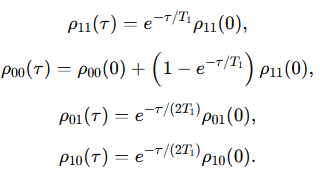
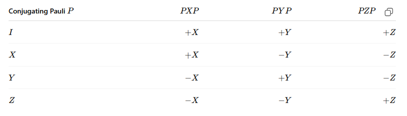

# Quantum channel 

- More general physical evolution when we have things like measurement, noise, decoherence, loss of information to an environment, or discarded measurement outcomes. Closed systems we have $\rho \to U \rho U^\dagger$, in general a channel is given by $\rho \to \mathcal{E}(\rho) = \rho'$, but $\rho'$ is a still valid density matrix $\rho'$ and $Tr(\rho') = 1$.

- It can be written as sum of Kraus op.
$$ \mathcal{E}(\rho) = \sum_k E_k \rho E_k^\dagger $$
many branches and possibly irresversible after averaging. For a closed system there is just one possible branch given by $U$, now for a open, general system multiple branches can exist each being represented by $E_k$. The channel is an avarege over possible Q branches.  

- However, E_k is not unique, then it might or might not correspond to the actual quantum trajectory. For example the Measurement of a qubit can be represented by $E_0 = |0\rangle \langle 0|, E_1 = |1\rangle \langle 1|$ or by $ E_0 = I/\sqrt{2}, E_1=Z/\sqrt{2}$. The former correspond exactly what we see when running an experiement, but the latter does not. 

- In open systems, Lindblad can be understood as an average over many stochastic quantum trajectories, as no-jump or jump histories. The smooth decay is the ensemble average. 

- Kraus ops. completeness condition:
$$  Tr(\rho ') = 1 = Tr(\mathcal{E}(\rho)) = Tr\Big(\sum_k E_k \rho E_k^\dagger\Big) = Tr\Big(\sum_k E_k^\dagger E_k \rho \Big) = Tr(\rho)$$
so, 

$$
\sum_k E_k^\dagger E_k = I
$$

Ex: Amplitude Damping ($T_1$)
The prob of $|1\rangle$ decays to $|0\rangle$ is $\gamma = 1 - e^{\tau/T_1}$. The damping channel has the Kraus operators:

$$
E_0 = 
\begin{pmatrix}
1 & 0 \\
0 & \sqrt{1-\gamma}
\end{pmatrix}

\quad \quad \quad

E_1 = 
\begin{pmatrix}
0 & \sqrt{\gamma} \\
0 & 0
\end{pmatrix}
$$
The first channel becomes 
$$
E_0 \rho E_0^\dagger = 
\begin{pmatrix}
\rho_{00} & \sqrt{1-\gamma}\rho_{01} \\
\sqrt{1-\gamma}\rho_{00} & (1-\gamma)\rho_{11}
\end{pmatrix}
$$
which reduces the 11 population and the coherences. And the second channel 
$$
E_1 \rho E_1^\dagger = 
\begin{pmatrix}
\gamma \rho_{11} & 0 \\
0 & 0
\end{pmatrix}
$$
corrects the 00 population. The full channel becomes:
$$
\rho' = 
\begin{pmatrix}
\rho_{00}+\gamma \rho_{11} & \sqrt{1-\gamma}\rho_{01} \\
\sqrt{1-\gamma}\rho_{00} & (1-\gamma)\rho_{11}
\end{pmatrix}
$$

just a physical explanation of the noise state comes from the decay probability to the enviroment, So we can write a pure state
$$
|\psi\rangle = \alpha |0\rangle + \beta |1\rangle \quad \to \quad |\psi\rangle = \alpha |0\rangle |E_0\rangle + \beta \sqrt{1-\gamma}|1\rangle|E_0\rangle + \beta \sqrt{\gamma}|0\rangle|E_1\rangle = |A\rangle|E_0\rangle +|B\rangle|E_1\rangle
$$
$$
\rho_s = Tr_E(\rho) = \sum_{i=0}^1 \langle E_i|(|\psi\rangle\langle\psi|)|E_i\rangle = |A\rangle\langle A| + |B\rangle\langle B| = \begin{pmatrix}
|\alpha|^2+\gamma |\beta|^2 & \sqrt{1-\gamma}\alpha\beta^* \\
\sqrt{1-\gamma}\alpha^*\beta & (1-\gamma)|\beta|^2
\end{pmatrix}
$$

## Positive operator-valued measure (POVM)

- The Kraus op. tells you what happens to the state in a branch k, but POVM element tells you the probability rule of that branch 
$$
M_k = E_k^{\dagger} E_k
$$
whre $\langle \psi | M_k | \psi \rangle  > 0  \to M_k > 0$ (all eigenvalues are nonnegative) and $\sum_k M_k = I$.
The propability of the outcome k evaluated on the state $\rho$ is $p_k = Tr(M_k \rho)$ 

- Summary: Kraus op tell you the state update $\rho \to (E_k \rho E_k^\dagger)/p_k$, whereas the POVM element tells you the prob. rule $p = Tr(M_k \rho)$.

### Selective vs Nonselective measurement

- Selective measurement means keeping the state after the measurement and condition the circuit based on the outcome. The post-measurement state becomes $\rho = \rho_k' = (E_k \rho E_k^\dagger)/p_k$

- Nonselective measurement means performing the measurement and discarding the result. The post-measurement state becomes $\rho_k' = \sum_k p_k \rho_k'$

# Errors

## Coherent error

Systematic unitary mistake: $R(\theta + \epsilon) = R(\theta)R(\epsilon)$. Like an unwanted Hamiltonian term or a calibration offset (not random noise). 
Ex: over- or under-rotations, unwated Z phases, residual two-qubit conidtional phase, wrong iSWAP angle, coherent crosstalk.
Say identity apply a small error rotation $R_x(\epsilon)$, if n times $R_x(n\epsilon)$. The prob error is $\sim \sin^2{(n \epsilon/2)} \sim n^2\epsilon^2/4$

$\rho \to R_x(\epsilon)\rho R_x^\dagger(\epsilon)$

This can harm an echo because coherent errors can look like physical signal. However, its decay may contain strutured oscillations or calibration-dependent biases. 
Say we want the gate $G$ but get a coherent error $E$, then $U = EG$. The echo becomes $U^\dagger U = E'G^\dagger EG$. The inverse is not the usual dagger rule, but another gate with another coherent error in general. For example, regardless the rotarion is $-\theta$ or $\theta$ the error is $+\epsilon$ meaning that a echo produces $2\epsilon$.  

## Stochastic error

While coherent errors create a systematic drift, stochastic error creates difussion. The trajectory becomes a probabilistic mixture rather than a single wrong trajectory.
Ex: Pauli strochastic errors? Bit-flip errors $\mathcal{E}(\rho) = (1-p)\rho + p X\rho X$, Phase-flip errors $\mathcal{E}(\rho) = (1-p)\rho + p Z\rho Z$. Pure stochatisc errors (prob channels) random jumps and decoherence
$P \sim n p$, where $p$ is the prob of the error to happen

Phase-flip suppress coherences: Say
$$ \rho= 
\begin{pmatrix}
a & c \\
c* & b
\end{pmatrix}
$$ 
then,
$$ \mathcal{E}(\rho)= 
\begin{pmatrix}
a & (1-2p)c \\
(1-2p)c* & b
\end{pmatrix}
$$ 
for $p =1/2$, all coherences are gone. 

Depolarizing noise:
$\mathcal{E}(\rho) = (1-p)\rho + \frac{p}{3} (X\rho X + Y\rho Y + Z\rho Z)$
which shrinks the bloch vector toward the center. 

Using Puali basis a qubit is given by $\rho = \frac{1}{2}(I + r_x X + r_y Y + r_z Z)$, where $r_k = \langle K \rangle$, for $K = X, Y, Z$. Also 
$$
\rho = \frac{1}{2}\begin{pmatrix}
1 + r_z & r_x - ir_y \\
r_x + ir_y & 1 - r_z 
\end{pmatrix}
$$
So, a Bit-flip makes $(r_x, r_y, r_z) \to (r_x, (1- 2p)r_y, (1- 2p) r_z)$ leaving X unchanged and shrinking y and z component. 
A Phase-flip makes $(r_x, r_y, r_z) \to ((1- 2p)r_x, (1- 2p)r_y, r_z)$ leaving Z unchanged and shrinking x and y component. 
Depolarizing channel makes $(r_x, r_y, r_z) \to (1- 4p/3)(r_x, r_y, r_z)$ shrinking x,y, and z component.

We see Puali stochatic errors as the ideal signal times noise damping factor. $S_{measured} \approx F_{noise}S_{ideal}$

## Pauli twirling

Randomize the error frame of a gate. Random Pauli gate before and after the noisy operation - ideal gate unchanged but noise after averaging becomes simpler. 

Make the error look like a stochastic Pauli channel. 

For an ideal gate G, the ideal opation $\rho \to G\rho G^\dagger$. Since we insert before and after a Pauli, we need this operation to preserve the G operation. First, $G P \rho P^\dagger G^\dagger$, then we need to find the pauli Q which $Q G P = G \to Q = G P\dagger G^\dagger$. Finally, $Q G P \rho P^\dagger G^\dagger Q^\dagger$. Now, including noise $\mathcal{E}(G \rho G^\dagger )$, then $Q \mathcal{E}(G P \rho P^\dagger G^\dagger) Q^\dagger$.

For a pure noise channel $\mathcal{E}$, without the actual Gate, The pauli twirling averages the noise over random Paulis
$$
\mathcal{E}_{twirled}(\rho) = \frac{1}{|\mathcal{P}|} \sum_{P \in \mathcal{P}} P^\dagger \mathcal{E} (P \rho P^\dagger) P
$$
many off-diagonal/coherent components of the noise channel are averaged away, remaining Pauli-diagonal
$$
\mathcal{E}_{twirled}(\rho) = p_I \rho + p_X X\rho X + p_Y Y\rho Y + p_Z Z\rho Z
$$
a stochastic channel. 

Ex: $R_z(\epsilon)\rho R_z^\dagger(\epsilon)$ makes $(r_x, r_y, r_z) \to (r_x cos(\epsilon) - r_y sin(\epsilon), r_x sin(\epsilon) + r_y cos(\epsilon), r_z)$. In the Pauli basis,
$$
R_z^{(before twirled)}(\epsilon) = \begin{pmatrix}
\cos \epsilon & -\sin \epsilon & 0 \\
\sin \epsilon & \cos \epsilon & 0 \\
0 & 0 & 1 \\
\end{pmatrix}
$$
The Twriling change the coherent error to a stochastic error which is diaoginal in Pauli
$$
R_z^{(twirled)}(\epsilon) = \begin{pmatrix}
\lambda_X & 0 & 0 \\
0 & \lambda_Y & 0 \\
0 & 0 & \lambda_Z \\
\end{pmatrix}
$$

Ex: $\mathcal{E}(X) = R_z(\epsilon) X R_z^\dagger(\epsilon) = cos \epsilon X + sin \epsilon Y$
We need first $PXP$: $IXI = X$, $XXX = X$, $YXY = -X$, $ZXZ = -X$ from 

Then, $\mathcal{E}(X)$ for each: $\mathcal{E}(IXI) = cos \epsilon X + sin \epsilon Y$, $\mathcal{E}(XXX) = cos \epsilon X + sin \epsilon Y$, $\mathcal{E}(YXY) = -cos \epsilon X - sin \epsilon Y$, $\mathcal{E}(ZXZ) = - cos \epsilon X - sin \epsilon Y$. 

Then, $P\mathcal{E}(X)P$ for each: $I\mathcal{E}(IXI)I = cos \epsilon X + sin \epsilon Y$, $X\mathcal{E}(XXX)X = cos \epsilon X + sin \epsilon (-Y)$, $Y\mathcal{E}(YXY)Y = -cos \epsilon (-X) - sin \epsilon Y$, $Z\mathcal{E}(ZXZ)Z = - cos \epsilon (-X) - sin \epsilon (-Y)$.
Adding everthing 

$$
\mathcal{E}_{twirled}(X) = \frac{1}{4}( cos \epsilon X + sin \epsilon Y + cos \epsilon X - sin \epsilon Y + cos \epsilon X - sin \epsilon Y + cos \epsilon X + sin \epsilon Y) = cos \epsilon X
$$
making diagonal as we wanted. The same can be done for $Y$ and $Z$. 

Pauli twirling can be written as a superoperator, because $\mathcal{P} = P $

However, we have to becareful when inserting the twirling for a gate we need to find the correct reverse Pauli. 
Operationally: you need to find a compensanting pauli P' for the GP applied. Because we want $P'GP = G$, then $P' = GPG^\dagger$. 

EX: $G = CZ$ and $P = X_1$. $CZ X_1 CZ = X_1 Z_2$. The compesating Pauli is different from the first Pauli. 

It does not guarantee: removal of leakage, removal of non-Markovian drift, perfect depolarizing noise, that every experimental bias disappears. 

## Non-Markovian error

The noise has memory or changes over time. 

Ex: Qubit freq drift during the exp., calibration over time, temperature or electronic errors, pulse, crosstalk on what the neighbohr did earlier, 1/f noise creating detunings, leakage affecting later gates. So $\{\mathcal{E_j}\}$ are not independent as a Markovian noise would be expected. $\mathcal{E_j} = \mathcal{E_j}(\text{previous gates, previous states, time, env})$  

How do you know the gates are good?

- Gate fidelity: compare single-qubit and two-qubit gate error rates, especially entangling gates.
- Readout error: measure assignment errors and consider readout mitigation.
- Decoherence: check `T1`, `T2`, and whether circuit duration is short compared with coherence times.
- Leakage: verify population is not leaving the computational subspace.
- Calibration drift: repeat calibrations or benchmarks over time.
- Crosstalk: check whether operations on one qubit disturb neighbors.
- Qubit selection: prefer connected qubits with strong two-qubit gates and stable readout.
- Circuit depth: compare expected signal with accumulated error budget.
- Control circuits: run identity echoes, no-perturbation echoes, randomized controls, and noise-only baselines.
- Statistical uncertainty: use enough shots and report error bars.