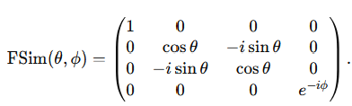
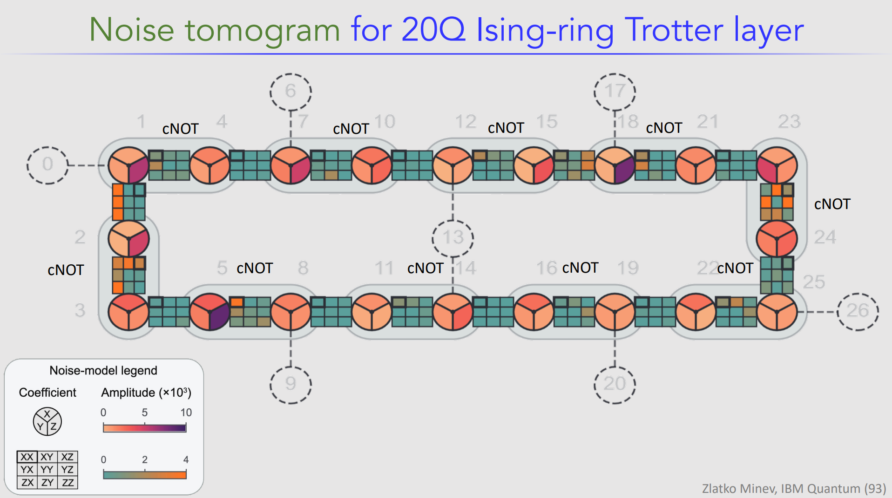

# Noise mitigation

Accept the noisy hardware, run multilple time to have a good prediction of the noise in the observable and with post-processing estimate what the system would have been noiseless. 

Different from Error correction which uses redundancy to encode the quantum information to detect the error and correct it. 

## Zero-noise extrapolation

- Run same logical noisy circuit, but run modified versions with deliberately amplified noise.

- Measure the observable vs noise level. By fitting the curve, extrapolate back to the hypothetical zero-noise value. 

say we have our observable $O(\lambda)$ affected by the noise scale $\lambda$. We find $O(\lambda) \sim a + b \lambda + c \lambda^2 + \dots$ and extrapolate $O_{ZNE} = O(0) \approx a$. 

### Circuit folding

The idea is simple, to amplify noise from the circuit, insert $U^\dagger U = I$. 

Nomenclature $U_{folded,3} = UU^\dagger U$, $U_{folded,5} = UU^\dagger U U^\dagger U, \dots$

Local folding: Instead of acting on the evolution operator, the folding is done in the gate level. Say we want to perform a gate $G$, the folded Gate will be $G_{folded,3} = GG^\dagger G$. It gives you more flexibility since one or two-qubit gates can be folded seperately, all gates, just one specific, and so on. 

Ex: $U = G_3 G_2 G_1$, $U_{folded} = G_3 (G_2 G_2^\dagger G_2) G_1$ 

To quantify $\lambda$, we basically assume gate count. Idle errors, leakage, readout, crosstalk 

- Statistical errors are small enough to make the fit meaningful.  

- FOlding amplifies: gate errors, decoherence, leakage accumation but not erros from final readout and state-preparation
$$
O(\lambda) = O_{gate-noise}(\lambda) + O_{readout-prep}
$$

## Floquet calibration

Similar idea to the ZNE, but it is a calibration technique to the hardware for coherent FSim/iSWAP parameters. It repeats the gate to amplify the error and fit the effective gate parameters. 

FSim - Fermionic simulation gate

$FSim(\theta, \phi) = iSWAP^{-2\theta/\pi}CZPowGate(exponent=-\phi/\pi)$ where $\theta$ controls $|10\rangle \leftrightarrow |01\rangle$ and $\phi$ controls conditional phase on $|11\rangle$.

PhasedFsim has additional parameters for adjusting local Z-rotations. 

Since the error is coherent the amplified error accumalates into a measurable osciilation or phase shift.

## Quantum error mitigation I

- SPAM: state preparation and Measurement error when your initial state is not correctly prepared. 

- Incoherent erros: irreversible errors.  

- Two of the mosto common techniques: ZNE and Probabilistic error cancelation (PEC) - more complicated but with more advantages. 

- Idea of noise cancellation: it is like an headphone. It learns about the  env. noise and add more noise, so on average they cancel. In quantum computing, there is a cost (basically shots).

- CPTP: completely positive trace-perserving. Any map has to be positive without negative eigenvalues and preserve trace to be physical. Therefore, you can not just try to perfectly invert a noise channel because it comes up to be non-CPTP

EX: 1 qubit and one gate = Identity gate, and bit flips happen with prob p.
Two possibilitie: II with prob (1-p) and XI with prob p. We basically take the inverses of those channels I and X and "ravel" in prob of applying I with prob (1-q) and X prob q.

For cases (inverse, noise, actual): III prob (1-q)(1-p), IXI prob (1-q)p, XII prob q(1-p), XXI prob qp
we want the middle to vanish because then we always cancel the noise. So, (1-q)p + q(1-p) = 0, q = -p/(1-2p)
q = 1/2 (diverges) because means maximally entropy/randonmness (info is completely gone because you always have the mixed state after channel).
we rewrite the inverse channel 
$$ \Lambda^{-1}(\rho)= (1-q) I\rho I+ qX\rho X$$
$$ \Lambda^{-1}(\rho)= \frac{|1-q| + |q|}{|1-q| + |q|}(sgn(1-q)|1-q| I\rho I+ sgn(q)|q|X\rho X)$$
$$ \Lambda^{-1}(\rho)= \gamma (s_{I} p_{I} I\rho I+ s_{X} p_{X}X\rho X)$$
$\gamma = |1-q| + |q|$, $s_{P} = $ is the sign of any Pauli, and $p_{X} = |q|/\gamma$ and $p_{I} = |1-q|/\gamma$ 

Now, The Measurement is $<Z> = Tr(ZI\Lambda \Lambda^-1 \rho)$. Using now, the additivity and distributivity of the trace
$$<Z> = \gamma [s_{I} p_{I} Tr(ZI\Lambda I \rho)+ s_{X} p_{X} Tr(ZI\Lambda X \rho) ]  = \gamma [s_{I} p_{I} <Z>_{I}+ s_{X} p_{X} <Z>_{X} ]$$
, where $<Z>_{P}$ are runable independent circuits. The values to find the true $<Z>$ are just classical post-processing. Run circuit with "I" and multiply the result by the sign, prob, and gamma. Same for X. 

## Quantum error mitigation II

- For PEC, you need to understand the noise. That is critical and difficult part.

- say X is a Bernoulli distribution with prob p. $E[X] = p$ and $Var[X] = p(1-p)$. Noiseless qubits measument is the same. For many shots, the mean S is $E[S] = E[X] = p = <Measument>$ and $V[S] = p(1-p)/M$. S is normal distribution $(p, sqrt[p(1-p)/M])$.

- If we contrainst this guassian (prob distribution) by an success prob of $1-\delta$ ($\delta$ is basically the confidence). We get Chernoff-Hoeffding Theorem, it defines a precision as well since 
$$ Pr[|S - <O>| > \epsilon] \leq \delta := 2\exp(-M\epsilon^2 / 2)$$
We can get then the number of shots for a certain precision and confidence. $M \geq 2\epsilon^{-2} \log(2\delta^{-1})$

How we learn the noise? 
- First thing, we need to simplify it. Pauli twrirling. It makes the noise Diagonal in Puali basis. 
- Second step, amplify the noise. Amplify the noise many times so based on the Chernoff-Hoeffding theorem, you will need less shots M.
- Third part, you learn from Pauli basis. Prepare the state at a Pauli and measure in the same Pauli. ----B----Noise----Bdagger---M
- The problem is that you have Gates not just noise. Especially entangling gates. Therefore, the property $\Lambda_i^k(P_a) = \lambda_i^k P_a$ cannot be used. So, you go the Lindblad operator, which is finding the generator of the noise $\Lambda(\rho) = exp[L](\rho)$. Like the Hamiltonian of the evolution operator. The idea relies on the sparseness of H leads to dense U. So, it is better to work with H.  
- Before construting the Lindblad op. There a trick to learn more about the noise fidelities. If only ----B----Noise Gate----Bdagger---M is implemented, you fix only one fidelity to learn. For example, B = XX and Noise gate = CZ, $XX \to^{CZ} -YY$ and $YY \to ^{CZ} -XX$ in the second layer, so the exp decays is $E(k) = A(f_{XX}f_{YY})^{k/2}$. However, if we implement a Pauli S,
----B----S--- Noise Gate---Sdagger----Bdagger---M, where $YY \to^{S} XX$, you can learn about (f_{XX}^k) instead. 
The first S change the B according to the fidilities you want to test it, the Sdagger brings back the B so you have an exponential decay. We need the Puali to cycle back so it decays exponentially the measurement of B.  
- However, we need to assume a shape for the Lindblad $L(\rho) = \sum_{k \in K} \lambda_k (P_k \rho P_k - \rho)$, where $K$ regards to the qubits connectivity (depends with it is a hexagonal, square, ... lattice). 
- For example for Q1-Q4-Q7-Q6, the $P_k$ are all the pauli for each Q, and the double Paulis like XX, XY, XZ, ..., for the pair Q1Q4, Q4Q7, Q6Q7, each $k$ has its "eigenvalue" $\lambda_k$ giving an amplitude of the noise. Majority one Pauli noise than composite Paulis. For larger Q strutucres it can be summirized as 

- How to connect $\lambda$ to exponents from the fittings? 
First, the $P_a$ is an eigenoperator of the proposed $L$. $L(P_a) = -2\left(\sum_{j:\{P_j,P_a\}=0} \lambda_j \right)P_a= \mu_a P_a$ where only the Pauli that anticommute to P_a contribute.
$\Lambda = e^L \to \Lambda(P_a) = e^{\mu_{a}}P_a$, the fidility is $f_a = \exp\left[-2\sum_{j:\{P_j,P_a\}=0} \lambda_j \right]$

Say $P_a$ is during the first noise channel and $P_b$ the second noise channel, the block is $f_a f_b$. If there are $k$ noisy entagling layers, the curve is $E_{ab}(k) = A_{ab}(f_a f_b)^{k/2}$. $f_a f_b = e^{-2\sum_j(M_{a,j} + M_{b,j})\lambda_j}$, where M_{a,j} is 1 if P_j anticommute to $P_a$ and 0 if they commute.
Therefore, for each $g_{ab}= \sqrt(f_a f_b)$, $d_{a,b} = -log{g_{a,b}} = \sum_j(M_{a,j} + M_{b,j})\lambda_j$. From, all $d_{a,b}$ known from the exponential fitting, we can find all $\lambda_j$.

- Once the rate are learned, the PEC factor for the noisy gate layer is
$$ \gamma = \exp \left( 2\sum_Q \lambda_Q\right) $$

## Quantum error mitigation III

- Now, we treat the noise learning as a method in which we can apply and get the respective $\gamma$ from each noisy gate.