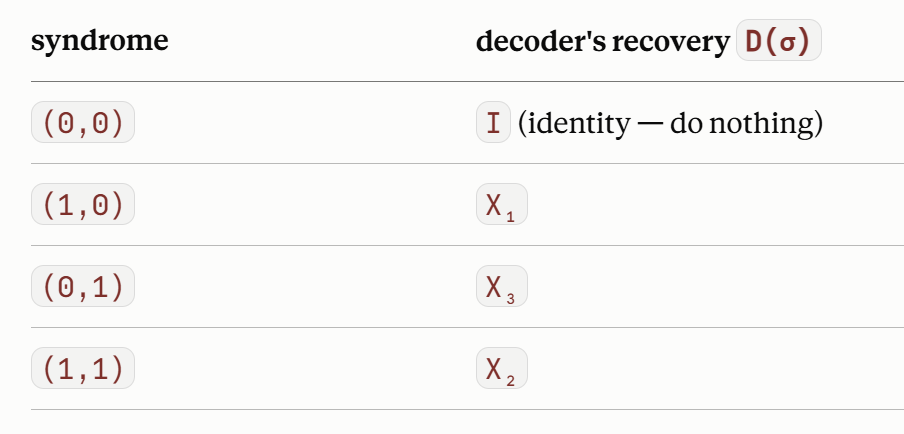

# Quantum error correction

$|\psi \rangle  = \alpha |000 \rangle + \beta |111 \rangle$, $000,111$ is the codespace. 

Redundancy notation $[[n,k,d]]$, n physical qubits, k logical qubits, d is the distance. 

Qubits errors are basically 2x2 matrices, so they can be expressed in Pauli basis. Pauli just commute or anticommute, which makes the syndrome measeurement clear. 

**encode**: from physical $\alpha |0 \rangle + \beta |1 \rangle$ to logical $\alpha |000 \rangle + \beta |111 \rangle$. It requires 2 CNOTs. The opposite is *"un-encoding"* not decoding. 

**weight of a Pauli string**: how many non-I in a string. wt(IXZYIZYXI) = 6. It tells you how bad is the error.  

**Stabilizers**: group of pauli S which all commute with each other. 
Codespace: subspace where every measured stabilizer returns $+1$. 
Stabilizers group example $ S = \{Z_1 Z_2, Z_2 Z_3\} = \{S_1,S_2\}$ (they need to return $+1$ eigenstates). These stabilizers just detect bit-flips, real codes detect more errors. 

**Syndrome**: say qubit $|psi\rangle$ occur $S|psi\rangle = m |psi\rangle$. If the error commutes with $S$, $m =1$. If the error anticommute with $S$, $m = -1$. The syndrome of a error E (syn(E)) is a tuple composed by one bit per stabilizer.
Example: $E[|000\rangle] = |010\rangle$. Then the stabilizers $S_1 |010\rangle = -1$ and $S_2 |010\rangle = -1$. So, the only option is that Q2 flip it, so decoder apply $X_2$ to correct it.
Here $syn(E) = (-1,-1)$.

**Decoder/recovery map**: which Pauli Op. recovers the damage. It is a function $D: \{\text{syndrome}\} \to \{ \text{Pauli Operator}\}$. 

**Correctable vs Uncorrectable errors**: When recovery map applies and correct the error, left the codespace with no damage. When not corrected, the error is uncorrectable, called logical error/ logical fault. 
EX: $E = X_1 X_2$, the $syn(E) = (0,1)$. So, the decouder thinks is a bit flip error in 3Q, and send the $X_3$ to correct it. Therefore, $X_3 (X_1 X_2) = X_L$. You didn't correct it and did a logical gate. 

**Distance**: minimium weight of an undetectable logical error. Minimum weight among all logical operators.  

**Logical op. & the normalizer/centralizer**: All Puali op. that commute with every stabilizer (they are not seen by the syndrome measurement). Logical op. don't trigger any syndrome, and don't kick you out of the codespace, so commutes to every stabilizer. Also, it needs to do an actual transformation between the logical states.
Example: $X_L = X_1X_2X_3$. (a) Commute to stabilizers? $[X_L, S] = 0$ (valid). (b) $X_L|000\rangle = |111\rangle$ (valid) 

**Fidelity**: prob after the correction cycle, there is no net logical error. $1- F$ logical failure probability.

